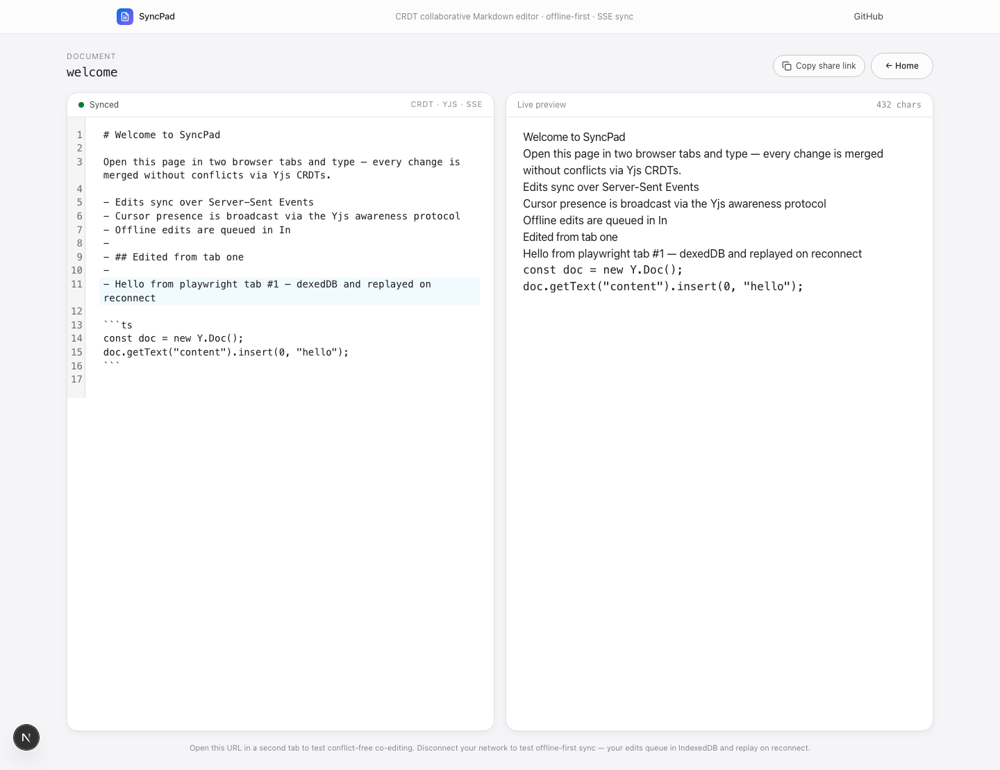
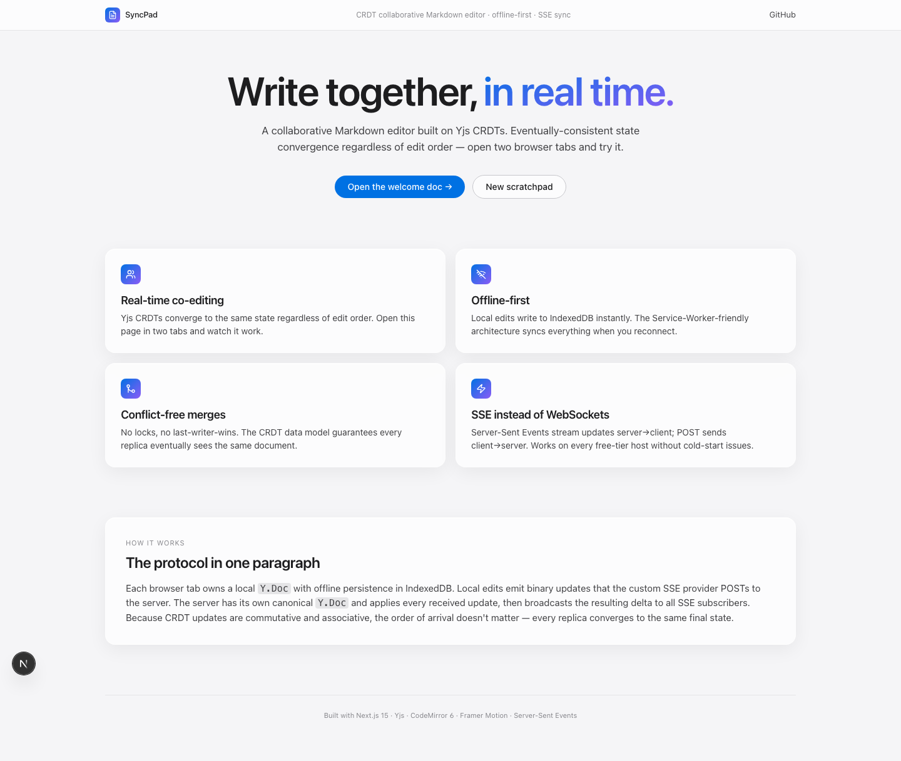

# SyncPad — CRDT Collaborative Markdown Editor

A real-time collaborative Markdown editor built on **Yjs CRDTs**. Eventually-consistent state convergence regardless of edit order, offline-first persistence in IndexedDB, and live sync over **Server-Sent Events + POST** — no WebSocket server required.



> The screenshot above is the welcome doc after two browser tabs edited it concurrently. Both inserts are present, the document converged to identical bytes on both sides, and the live Markdown preview renders alongside.

## Screens

| | |
|---|---|
|  |  |
| **Landing** — explains the architecture in one paragraph | **Editor** — CodeMirror 6 + Yjs bound editor with live Markdown preview |

## Why This Project

- **Real-time collaboration + distributed systems** appears in senior SDE interviews at Google, Meta, Notion, Figma
- Shows: CRDTs, offline-first, service workers, real-time sync, conflict resolution
- Demonstrates understanding of distributed systems without needing distributed infrastructure
- SSE (Server-Sent Events) works on Render free tier — no cold-start WebSocket issues

## The Problem

Real-time collaboration tools (Google Docs, Notion, Figma) seem magical — multiple users editing the same document with no conflicts. The underlying technology (CRDTs/OT) is one of the hardest CS problems to implement correctly. SyncPad demystifies it with a clean, buildable implementation.

## What It Does

```
┌─────────────────────────────────────────────────────┐
│ SyncPad                    🟢 Online  2 editors     │
│                                                       │
│ ┌─────────────────────┬─────────────────────┐        │
│ │ Markdown Editor      │ Live Preview        │        │
│ │                      │                     │        │
│ │ # Meeting Notes      │ Meeting Notes       │        │
│ │                      │ ═══════════════     │        │
│ │ ## Action Items      │ Action Items        │        │
│ │                      │ ────────────        │        │
│ │ - [x] Ship v2 API   │ ☑ Ship v2 API      │        │
│ │ - [ ] Update docs ← │ ☐ Update docs      │        │
│ │   (Alice typing...)  │                     │        │
│ │ - [ ] Review PRs     │ ☐ Review PRs       │        │
│ │                      │                     │        │
│ │ ```python            │ def hello():        │        │
│ │ def hello():         │     return "world"  │        │
│ │     return "world"   │                     │        │
│ │ ```                  │                     │        │
│ └─────────────────────┴─────────────────────┘        │
│                                                       │
│ Cursors: 🔵 You (line 8)  🟣 Alice (line 5)         │
│ Last synced: 2s ago  |  Offline edits: 0             │
│                                                       │
│ Documents    Share    Version History    Settings     │
└─────────────────────────────────────────────────────┘
```

### Features

**Built and shipping:**
- **Real-time multi-tab collaboration** — Yjs CRDT updates flow over a custom Server-Sent Events provider; documents converge regardless of edit order (verified in `tests/crdt.test.ts`)
- **Offline-first persistence** — local edits write to IndexedDB instantly via `y-indexeddb`; the SSE provider posts queued deltas when the network comes back
- **Live Markdown preview** alongside the editor
- **Undo/redo** via CodeMirror history (per-tab, integrates with Yjs)
- **CodeMirror 6 with Yjs binding** — line numbers, soft wrap, Markdown syntax
- **Echo prevention** — every POST carries an origin id so the originating tab ignores its own broadcast

**Planned (see Roadmap):**
- Cross-tab cursor presence (the awareness protocol is wired locally; cross-tab fan-out has a known gap that's tracked)
- Doc list + share links with view/edit permission tokens
- Postgres-backed persistence (currently in-memory on the server)
- Migration to Hono on Cloudflare Workers + Durable Objects for stateful sync at scale

### Distributed Systems Concepts

| Concept | Implementation |
|---|---|
| **CRDTs** | Yjs CRDT library for conflict-free text editing |
| **Offline-first** | IndexedDB persistence + service worker caching |
| **Eventual consistency** | Documents converge to same state regardless of edit order |
| **Presence protocol** | Awareness API for cursor positions and user status |
| **SSE vs WebSocket** | SSE for server→client, POST for client→server (free-tier friendly) |
| **Optimistic updates** | Apply edits locally first, sync to server async |
| **Delta sync** | Only send changes (deltas), not full document state |

## Architecture

```
┌──────────────┐     SSE (server→client)     ┌──────────────┐
│   Browser    │◀────────────────────────────│   Server     │
│              │                              │   (Render)   │
│  ┌────────┐  │     POST (client→server)    │              │
│  │  Yjs   │  │────────────────────────────▶│  ┌────────┐  │
│  │  CRDT  │  │                              │  │  Yjs   │  │
│  └────────┘  │                              │  │  Server│  │
│  ┌────────┐  │                              │  └────────┘  │
│  │IndexedDB│  │                              │  ┌────────┐  │
│  │(offline)│  │                              │  │  Neon  │  │
│  └────────┘  │                              │  │  (save) │  │
│  ┌────────┐  │                              │  └────────┘  │
│  │Service │  │                              │              │
│  │Worker  │  │                              │              │
│  └────────┘  │                              │              │
└──────────────┘                              └──────────────┘

Sync Flow:
1. User types → Yjs CRDT applies locally (instant)
2. Delta encoded → POST to server
3. Server merges via Yjs → broadcasts via SSE to other clients
4. Offline? → queued in IndexedDB → synced on reconnect
```

## Tech Stack (All Free)

| Component | Tool | Cost |
|---|---|---|
| App framework | Next.js 15 (App Router, Node runtime API routes) | $0 |
| CRDT Engine | Yjs (with y-protocols for awareness) | $0 |
| Editor | CodeMirror 6 + y-codemirror.next binding | $0 |
| Real-time Sync | Custom **Server-Sent Events** provider + POST deltas | $0 |
| Offline Storage | IndexedDB via y-indexeddb | $0 |
| Markdown Render | marked | $0 |
| Styling | Tailwind v3 + Framer Motion, design tokens via the `frontend-design` Skill | $0 |
| CI/CD | GitHub Actions (Node 20 & 22 matrix) | $0 |
| Hosting | Vercel (frontend + Node-runtime API routes) | $0 |

> **Production target:** Hono on Cloudflare Workers + Durable Objects for stateful sync. The current Next.js implementation is functionally equivalent and locally runnable, which matters for the portfolio demo.

## Project Structure

```
syncpad/
├── app/                          # Next.js 15 App Router
│   ├── page.tsx                  # Landing — hero, feature grid, protocol explainer
│   ├── doc/[id]/page.tsx         # Split-pane editor + live Markdown preview
│   ├── layout.tsx
│   └── api/docs/
│       ├── route.ts              # GET — list docs
│       └── [id]/
│           ├── sse/route.ts      # GET — SSE stream of doc + awareness updates
│           ├── update/route.ts   # POST — receive Y.Doc delta from a client
│           └── awareness/route.ts # POST — receive awareness update from a client
├── server/
│   └── doc-store.ts              # In-memory Y.Doc registry + pub/sub
├── lib/
│   └── sse-provider.ts           # Client-side custom Yjs SSE provider
├── components/
│   ├── editor.tsx                # CodeMirror + Yjs + y-indexeddb + awareness
│   ├── preview.tsx               # Live Markdown via marked
│   └── nav.tsx
├── tests/
│   ├── crdt.test.ts              # 5 convergence tests (cross-sync, partition heal,
│   │                             #  simultaneous-insert, offline replay, diff-size)
│   └── doc-store.test.ts         # 4 pub/sub + encode/decode tests
├── .claude/skills/frontend-design/SKILL.md   # design system the UI follows
├── .github/workflows/ci.yml      # pytest equiv: vitest + build matrix
├── tailwind.config.ts
└── README.md
```

## Run Locally

```bash
git clone https://github.com/DevNagi31/syncpad.git
cd syncpad
npm install
npm run dev
# → http://localhost:3020

# Test conflict-free co-editing:
#   open http://localhost:3020/doc/welcome in two browser tabs and type.
# Test offline-first sync:
#   chrome devtools → Network → Offline → keep typing → re-enable → see it sync.

npx vitest run            # 9 unit tests covering CRDT convergence + doc-store
npm run build             # production build
```

## Why SSE Instead of WebSockets

| | WebSocket | Server-Sent Events |
|---|---|---|
| **Render Free Tier** | Breaks on cold start (30s timeout) | Works perfectly |
| **Reconnection** | Manual implementation needed | Built-in auto-reconnect |
| **Direction** | Bidirectional | Server→client only (POST for client→server) |
| **Complexity** | Connection management, heartbeats | Simple HTTP streaming |
| **For this project** | Overkill — we only need server push | Perfect fit |

This is the project that shows you understand distributed systems — the hardest part of scaling software.
